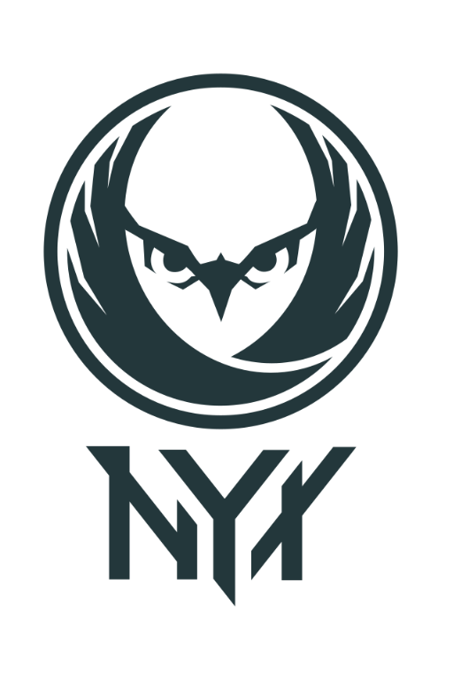

# Nyx

This repository contains an overview of the Nyx project. The Nyx project consists of its core component, a modified version of QEMU that allows to take and reset VM snapshots thousands of times per second, a modified version of KVM to enabled nested fuzzing and Intel-PT tracing during fuzzing, as well as some auxilary tools such as Spec-Fuzzer, a fuzzer specificially designed for fuzzing complex interactive targets. Spec-Fuzzer is capable of fuzzing anything that runs inside of KVM. This includes applications, kernels and even hypervisors - Nyx can be used to easily build fuzzers for almost anything.

<p>

</p>

## Repositories

Nyx framework consists in total of the following modules. 

#### Core
- [libnyx](https://github.com/nyx-fuzz/libnyx) - a library that you can readily use to run, snapshot and restore VMs to build your own fuzzers.
- [packer](https://github.com/nyx-fuzz/packer) - a tool that allows to bundle and pack targets into the type of VM we mostly use for ring-3 fuzzing.
- [QEMU-Nyx](https://github.com/nyx-fuzz/QEMU-Nyx) - a modified version of QEMU that allows to take and restore snapshot, as well as communication via shared memory and hypercalls.
- [KVM-Nyx](https://github.com/nyx-fuzz/KVM-Nyx) - a modified version of KVM that enables Nyx's ability to use Intel-PT.
- [libxdc](https://github.com/nyx-fuzz/libxdc) - the fastest Intel-PT decoder in the west. Used to get coverage information from binary targets.

#### Fuzzer-Frontends

- [Spec-Fuzzer](https://github.com/nyx-fuzz/spec-fuzzer) - An example fuzzer that allows to fuzz targets with highly interactive inputs such as syscalls, hypercalls, API calls, GUI interations or -of course - network applications.
- [AFL++](https://github.com/AFLplusplus/AFLplusplus/tree/stable/nyx_mode) - Nyx integration has just landed in AFL++. It is implemented by using libnyx to enable fast snapshot-based fuzzing of arbitrary x86/x86-64 code running in QEMU-Nyx. It supports almost all features provided by Nyx (with the exception of REDQUEEN and some other more advanced features). If you want to fuzz userland targets, in-process file parsers, kernel interfaces or something else, you should definitely check it out. 

You can find an incomplete documentation and some tutorials [here](docs/). Or check out the [Nyx mode documentation](https://github.com/AFLplusplus/AFLplusplus/blob/stable/nyx_mode/README.md) in the AFL++ repository.

## Talk
[](https://www.youtube.com/watch?v=jkNao0SjBAA)

## Papers

In case you use one of Nyx`s components for your work, please consider to cite our papers:


```
@inproceedings{schumilo2017kafl,
  author = {Schumilo, Sergej and Aschermann, Cornelius and Gawlik, Robert and Schinzel, Sebastian and Holz, Thorsten},
  title = {{kAFL: Hardware-Assisted Feedback Fuzzing for OS Kernels}},
  year = {2017},
  booktitle = {USENIX Security Symposium}
}

@inproceedings{redqueen,
  title={REDQUEEN: Fuzzing with Input-to-State Correspondence},
  author={Aschermann, Cornelius and Schumilo, Sergej and Blazytko, Tim and Gawlik, Robert and Holz, Thorsten},
  booktitle={Symposium on Network and Distributed System Security (NDSS)},
  year={2019},
}

@inproceedings{nautilus,
  title={{Nautilus:  Fishing for Deep Bugs with Grammars}},
  author={Aschermann, Cornelius and Frassetto, Tommaso and Holz, Thorsten and Jauernig, Patrick and Sadeghi, Ahmad-Reza and Teuchert, Daniel },
  booktitle={Symposium on Network and Distributed System Security (NDSS)},
  year={2019}
}

@inproceedings{blazytko2019grimoire,
  author = {Tim Blazytko and Cornelius Aschermann and Moritz Schl{\"o}gel and Ali Abbasi and Sergej Schumilo and Simon W{\"o}rner and Thorsten Holz},
  title =  {{GRIMOIRE}: Synthesizing Structure while Fuzzing},,
  year = {2019},
  booktitle = {USENIX Security Symposium}
}

@inproceedings{ijon,
  author    = {Cornelius Aschermann and Sergej Schumilo and Ali Abbasi and Thorsten Holz},
  title     = {Ijon: Exploring Deep State Spaces via Fuzzing},
  booktitle = {IEEE Symposium on Security and Privacy},
  year      = {2020},
}

@inproceedings{hypercube,
  title={{HYPER-CUBE: High-Dimensional Hypervisor Fuzzing}},
  author={Schumilo, Sergej and Aschermann, Cornelius and Abbasi, Ali and W{\"o}rner, Simon and Holz, Thorsten},
  booktitle=isoc-ndss,
  year={2020}
}

@inproceedings {nyx,
  author = {Sergej Schumilo and Cornelius Aschermann and Ali Abbasi and Simon W{\"o}r-ner and Thorsten Holz},
  title = {Nyx: Greybox Hypervisor Fuzzing using Fast Snapshots and Affine Types},
  booktitle = {30th {USENIX} Security Symposium ({USENIX} Security 21)},
  year = {2021},
  url = {https://www.usenix.org/conference/usenixsecurity21/presentation/schumilo},
}

@misc{nyxnet,
  title={Nyx-Net: Network Fuzzing with Incremental Snapshots}, 
  author={Sergej Schumilo and Cornelius Aschermann and Andrea Jemmett and Ali Abbasi and Thorsten Holz},
  year={2021},
  eprint={2111.03013},
  archivePrefix={arXiv},
  primaryClass={cs.CR}
}
```


## Bug Reports and Contributions

If you found and fixed a bug on your own: We are very open to patches, please create a pull request!  

### License

This framework is provided under **MIT**, **GPLv2** and **AGPL license**. Please check each repository for its own specific license. 

**Free Software Hell Yeah!** 

Proudly provided by: 
* [Sergej Schumilo](http://schumilo.de) - sergej@schumilo.de / [@ms_s3c](https://twitter.com/ms_s3c)
* [Cornelius Aschermann](https://hexgolems.com) - cornelius@hexgolems.com / [@is_eqv](https://twitter.com/is_eqv)
