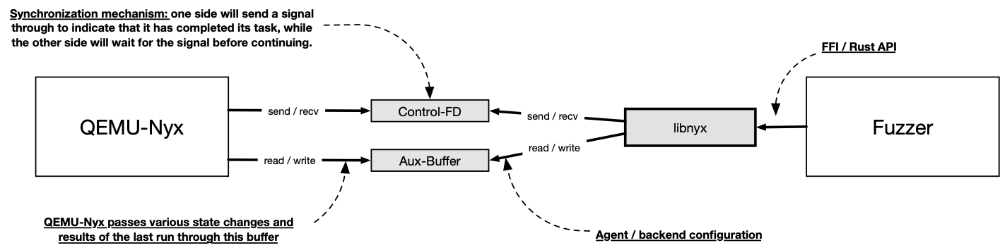

# QEMU-Nyx Interfaces

In this section, we will a have look at the interface between [QEMU-Nyx](https://github.com/nyx-fuzz/QEMU-Nyx) and the fuzzing frontend, along with its implementation in either  [libnyx](https://github.com/nyx-fuzz/libnyx) or [kAFL](https://github.com/IntelLabs/kAFL). This interface enables and facilitates the communication between both Nyx components and data exchange between the backend and the frontend.

In the following, we refer to QEMU-Nyx as the backend component in the Nyx fuzzer stack and the actual fuzzer as the frontend (either by using libnyx or implementing its own interfacing code, such as kAFL).

*Note*: This documentation refers only to the latest version of Nyx and especially Intel's kAFL fork. The following information does not match the outdated code released with the [kAFL](https://www.usenix.org/conference/usenixsecurity17/technical-sessions/presentation/schumilo), [Nyx](https://www.usenix.org/system/files/sec21-schumilo.pdf), and [Nyx-Net](https://www.usenix.org/system/files/sec21-schumilo.pdf) paper.


## Overview

From a technical standpoint, the communication between the backend component and the frontend component is accomplished through two different file-based IPC channels: a UNIX socket and a dedicated shared memory buffer referred to as the *auxiliary buffer*. Both files are located within the working directory (`workdir`) and created by QEMU-Nyx. The path to the working directory is specified through an additional command line parameter, which is usually set by the fuzzing frontend. Once the working directory is specified, the frontend spawns a QEMU-Nyx process per virtual machine (VM), which then creates both files to enable communication between the backend and frontend.

The shared-memory aux buffer serves two primary purposes. First, it is used to pass new configurations to QEMU-Nyx. This might include changes to the timeout value, a signal to drop an incremental snapshot, or to enable the "input buffer write protection". Second, QEMU-Nyx uses this buffer to pass information regarding the last task or fuzzing run back to the fuzzer. This includes data such as the total run time of the last fuzzing job, the number of dirtied pages, and whether the target has crashed or timed out.

In contrast, the UNIX file socket, which is also referred to as the "control socket" or "Control-FD", functions as a simple synchronization mechanism for the aux buffer. It is used to signal each side that a task has been completed and vice versa. 



## Aux-Buffer Values

In the following, we will have a closer look at the actual structure of the aux buffer. It's important to note that this structure may be subject to changes in future releases. The actual implementation can be found [here](https://github.com/nyx-fuzz/QEMU-Nyx/blob/qemu-nyx-4.2.0/nyx/auxiliary_buffer.h). In total, the aux buffer consists of four different sections.

### `auxilary_buffer_header_t`

The first section, referred to as `auxilary_buffer_header_t`, is a static header type that contains the following fields:

```c
typedef struct auxilary_buffer_header_s {
    uint64_t magic;
    uint16_t version;
    uint16_t hash;
} __attribute__((packed)) auxilary_buffer_header_t;
```

- `magic`: This field always stores the value `0x54502d554d4551` or the little-endian encoded string `QEMU-PT` (the former name of QEMU-Nyx). The frontend verifies this value to ensure that the aux buffer file contains a valid aux buffer structure.

- `version`: This field is also checked by the frontend to ensure that both the backend and frontend are using the same aux buffer version.
- `hash`: This is another static value that needs to be checked by the frontend implementation. Its value is calculated based on the overall structure of the aux buffer and will change whenever new fields are introduced. This field serves as another sanity check to ensure that both the backend and frontend use the same aux buffer structures.

### `auxilary_buffer_cap_s`

This section of the aux buffer contains various information about the supported capabilities both of the backend and agent running within the target VM:

```C
typedef struct auxilary_buffer_cap_s {
    uint8_t redqueen;
    uint8_t agent_timeout_detection;
    uint8_t agent_trace_bitmap; 
    uint8_t agent_ijon_trace_bitmap; 
    uint32_t agent_input_buffer_size;
    uint32_t agent_coverage_bitmap_size; 
} __attribute__((packed)) auxilary_buffer_cap_t;
```

The `redqueen` field signifies whether the target or backend supports the [REDQUEEN](https://www.ndss-symposium.org/ndss-paper/redqueen-fuzzing-with-input-to-state-correspondence/) technique. Currently, this field is only set for targets running in Intel PT mode. However, with future releases, we plan to have this field also indicate whether the agent supports [AFL++](https://github.com/AFLplusplus/AFLplusplus)'s compile-time "REDQUEEN" implementation called [`CMPLOG`](https://github.com/AFLplusplus/AFLplusplus/blob/stable/instrumentation/README.cmplog.md).

The `agent_timeout_detection` field indicates if the agent has implemented its own timeout detection. Although this feature is currently unused, it is designed to provide the ability to use a more precise timeout detection mechanism. This is necessary since the VM-based timeout detection used by Nyx is somewhat imprecise and not well-suited for very small timeout values. This capability is not fully implemented in QEMU-Nyx yet, but it is planned for future versions to automatically set the VM-based timeout mechanism next to the agent-based timeout to a value of 2x to prevent any deadlocks caused by a faulty agent implementation.

Nyx currently supports two different modes for gathering and providing target feedback information to the frontend implementation. This includes both Intel PT and feedback via compile-time instrumentations. If the agent passes the guest virtual address (GVA) of a specific buffer containing the information and its length, then `agent_trace_bitmap` is set to 1. Otherwise, only Intel PT support is available for this target

The size of the feedback buffer is set by the frontend using a command line argument. This value is fixed in Intel PT mode but can be changed by the agent in compile-time mode. If the agent expects a different buffer size, this new value is propagated in `agent_coverage_bitmap_size`. The frontend is then expected to resize the bitmap buffer accordingly. At the same time, the agent can request a different input buffer size via `agent_coverage_bitmap_size`. If both fields contain 0, the default size is used (or the size configured via command line arguments).

Nyx supports partial [IJON](https://ieeexplore.ieee.org/document/9152719) support, which requires implementation by both the agent and the frontend. The `agent_ijon_trace_bitmap` field indicates whether the agent expects to allocate and use another shared-memory file for this feature.

### `auxilary_buffer_config_t`

This section of the aux buffer contains all by the frontend configurable fields:

```C
typedef struct auxilary_buffer_config_s {
    uint8_t changed;

    uint8_t  timeout_sec;
    uint32_t timeout_usec;

    uint8_t redqueen_mode;
    uint8_t trace_mode; 
    uint8_t reload_mode;
    uint8_t verbose_level;

    uint8_t  page_dump_mode;
    uint64_t page_addr;

    uint8_t protect_payload_buffer;
    uint8_t discard_tmp_snapshot;
} __attribute__((packed)) auxilary_buffer_config_t;

```

...

### `auxilary_buffer_result_t`

The backend will store information about each finished task in this section of the aux buffer. A completed task does not necessarily imply that a fuzzing iteration has been completed (but more details on this later).

```C
typedef struct auxilary_buffer_result_s {
    uint8_t state;
    uint8_t exec_done;
    uint8_t exec_result_code;
    uint8_t reloaded;

    uint8_t pt_overflow;
    uint8_t page_not_found;
    uint8_t tmp_snapshot_created; 
    uint8_t padding_3;

    uint64_t page_addr;
    uint32_t dirty_pages;
    uint32_t pt_trace_size;
    uint32_t bb_coverage;
    uint32_t runtime_usec;
    uint32_t runtime_sec;
} __attribute__((packed)) auxilary_buffer_result_t;
```

...